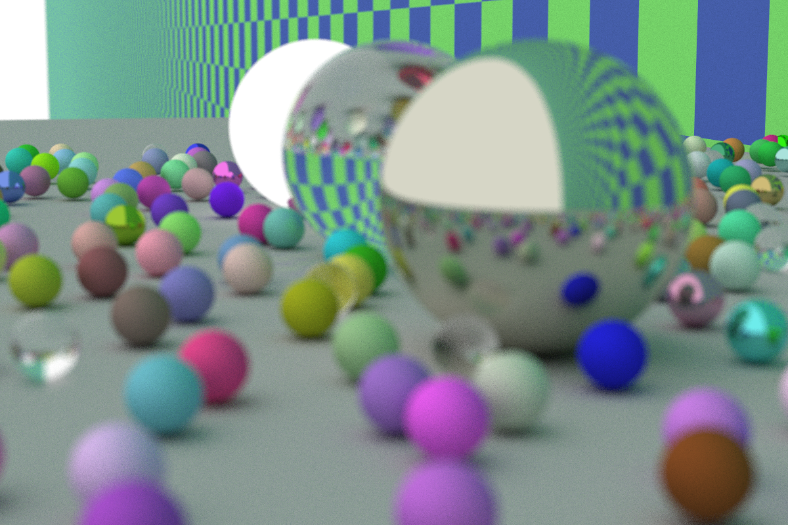
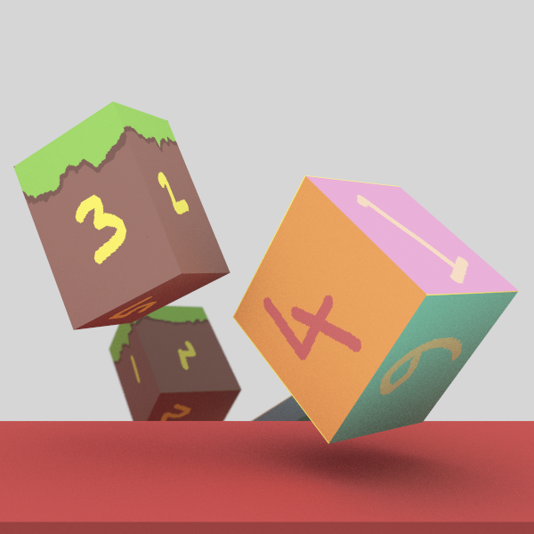
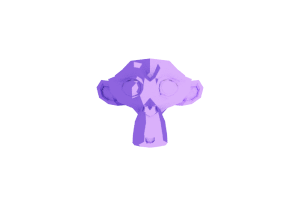

A simple ray tracer in Rust based of [Peter Shirley's Ray Tracing in a Weekend Series](https://raytracing.github.io/).

Use `cargo run` to generate a .png scene. The scenes are hardcoded, so you'll have to modify main to get the scene you want (This is a TODO).

The scene and 

## Sample Renders

.png)

